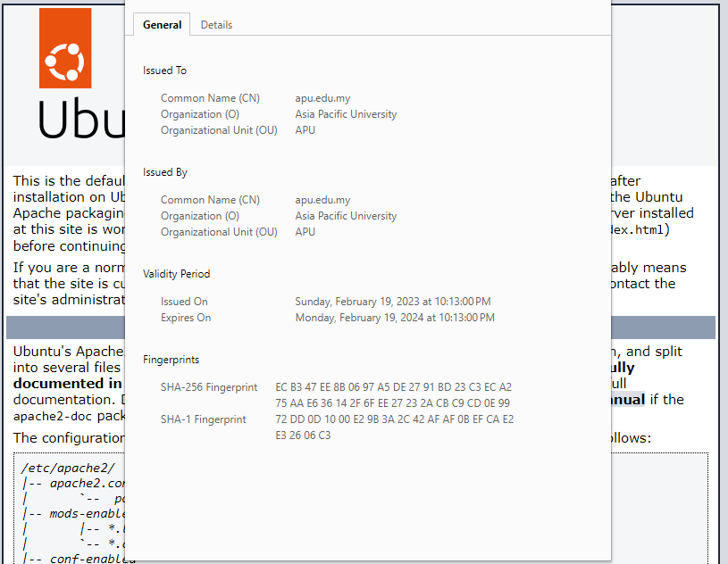
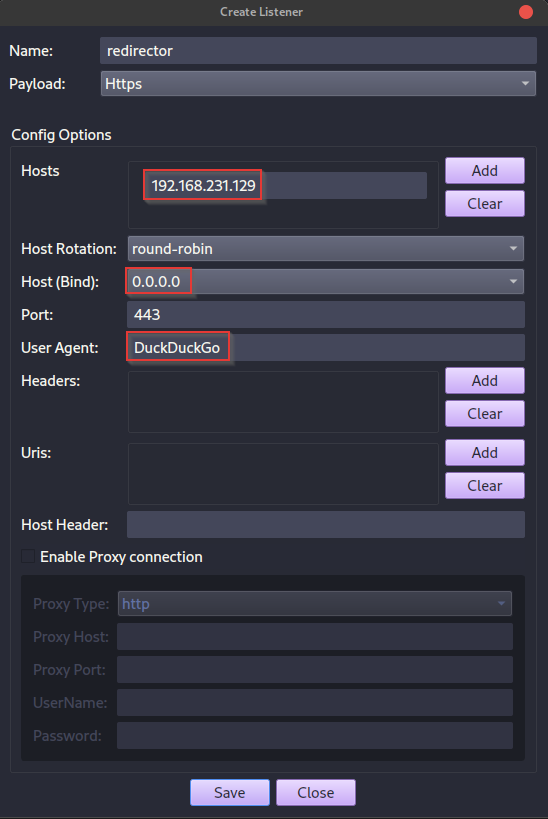

1. SSH into Redirector with user `redirector` and password `havoc`.
```
┌──(kali💀JesusCries)-[~/Desktop]
└─$ ssh redirector@192.168.231.129
redirector@192.168.231.129's password: havoc
```

2. Initialize Apache service on Redirector.
```
redirector@redirector:~$ sudo systemctl restart apache2
[sudo] password for redirector: havoc
```

3. Generate SSL keypair on Attacker Linux.
```
┌──(kali💀JesusCries)-[~/Desktop]
└─$ openssl req -new -newkey rsa:4096 -x509 -sha256 -days 365 -nodes -out public.crt -keyout private.key
Generating a RSA private key
................................................++++
....................++++
writing new private key to 'private.key'
-----
You are about to be asked to enter information that will be incorporated
into your certificate request.
What you are about to enter is what is called a Distinguished Name or a DN.
There are quite a few fields but you can leave some blank
For some fields there will be a default value,
If you enter '.', the field will be left blank.
-----
Country Name (2 letter code) [AU]:MY
State or Province Name (full name) [Some-State]:
Locality Name (eg, city) []:KL
Organization Name (eg, company) [Internet Widgits Pty Ltd]:Asia Pacific University
Organizational Unit Name (eg, section) []:APU
Common Name (e.g. server FQDN or YOUR name) []:apu.edu.my
Email Address []:
```

4. Copy and paste `private.key` file to Redirector.
```
redirector@redirector:~$ sudo vim /etc/ssl/private/private.key
```
> Use `:wq` to save and quit; `:qa` to cancel save and quit in Vim

5. Copy and paste `public.crt` file to Redirector.
```
redirector@redirector:~$ sudo vim /etc/ssl/certs/public.crt
```

6. Navigate to `https://192.168.231.129` and inspect self-signed SSL certificate.



7. Create HTTPS Listener for Traffic Redirection.



8. Generate SSH keypair for SSH tunneling.
```
redirector@redirector:~$ ssh-keygen
Generating public/private rsa key pair.
Enter file in which to save the key (/home/redirector/.ssh/id_rsa): 
Enter passphrase (empty for no passphrase): 
Enter same passphrase again: 
Your identification has been saved in /home/redirector/.ssh/id_rsa
Your public key has been saved in /home/redirector/.ssh/id_rsa.pub
```

> Copy contents of `/home/redirector/.ssh/id_rsa.pub` and save as `redirector` (identity file) in Attacker Linux

9. On Attacker Linux VM, setup a SSH tunnel to Redirector.
```
┌──(kali💀JesusCries)-[~/Desktop]
└─$ ssh -N -R 8443:localhost:443 -i redirector redirector@192.168.231.129
```

9. Verify SSH tunneling from Redirector.
```
redirector@redirector:~$ sudo ss -ltnp
State           Recv-Q          Send-Q                     Local Address:Port                     Peer Address:Port          Process                                   
LISTEN          0               128                            127.0.0.1:8443                          0.0.0.0:*              users:(("sshd",pid=1769,fd=9))           
```

10. Customize `.htaccess` file under `/var/www/html` and restart Apache service.
```
redirector@redirector:~$ sudo vim /var/www/html/.htaccess
```

```
RewriteEngine on

RewriteCond %{REQUEST_URI} "demon.exe" [NC,OR]
RewriteCond %{REQUEST_URI} "demon.bin" [NC]
RewriteRule ^.*$ "https://localhost:9090%{REQUEST_URI}" [P]

RewriteCond %{HTTP_USER_AGENT} "DuckDuckGo" [NC]
RewriteRule ^.*$ "https://localhost:8443%{REQUEST_URI}" [P]

RewriteRule ^.*$ "https://www.google.com" [L,R=302]
```

```
redirector@redirector:~$ sudo systemctl restart apache2
```

11. Revisiting `https://192.168.231.129` will redirect you to google.com.
